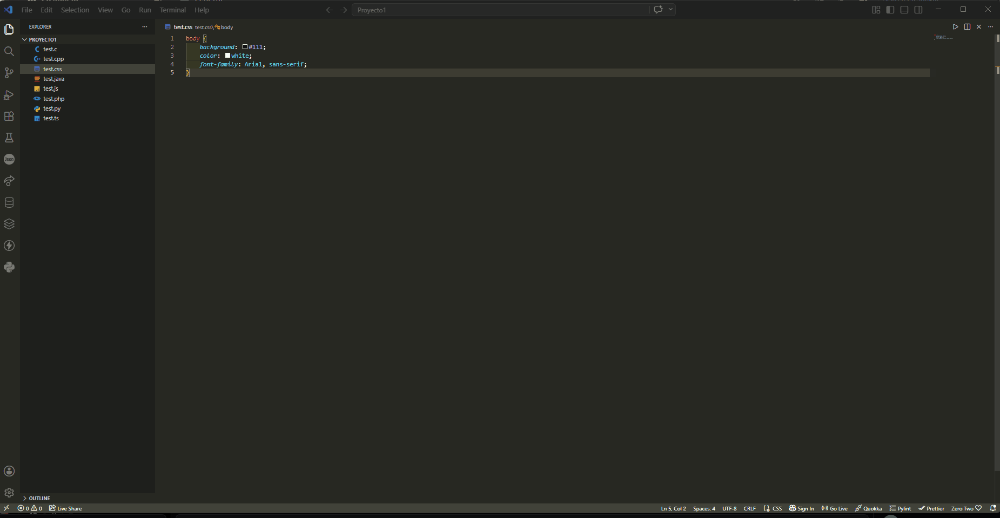
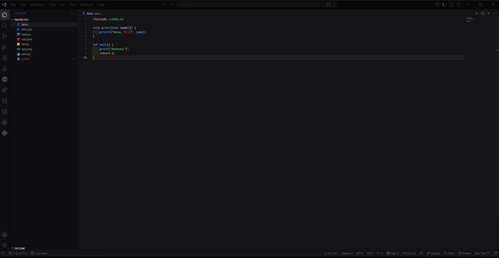

# Smart Theme Switcher

> Automatically changes your VS Code theme based on your project, time of day, programming language, or favorites.

> Automáticamente cambia el tema de VS Code según tu proyecto, hora del día, lenguaje de programación o tus favoritos.

---

## English 🇬🇧

### What does it do?

Smart Theme Switcher lets you automatically change the Visual Studio Code theme using different modes that you can combine:

| Mode | What it does |
|---|---|
| **Workspace** | Each project gets its own theme. When you open a project, the theme applies automatically |
| **Time** | Changes the theme based on time of day (morning, afternoon, night) using real sunrise/sunset data with your location |
| **Favorites** | Rotates through your favorite themes manually (with command) or automatically (on a time interval) |
| **Language** | Changes the theme based on the language of the file you're editing (JavaScript = dark, Python = light, etc.) |

### Demos

  
<strong>Workspace Mode</strong>

  
    
  
<strong>Language Mode</strong>

  

### Commands

Open the command palette (`Ctrl+Shift+P` / `Cmd+Shift+P`) and type `Smart Theme`:

| Command | Description |
|---|---|
| `Smart Theme: Change Theme Now` | Switch to the next available theme based on the active mode. In favorites mode, cycles to the next favorite |
| `Smart Theme: Enable/Disable` | Enable or disable the extension |
| `Smart Theme: Set Mode` | Configure which modes you want to use (you can select multiple at the same time). If you enable time mode without a location set, you'll be prompted to configure it |
| `Smart Theme: Add Favorite` | Add themes to your favorites list for rotation. Currently saved favorites appear pre-checked |
| `Smart Theme: Set Workspace Theme` | Assign a theme to your currently open project |
| `Smart Theme: Manage Workspace Themes` | Manage all project-theme mappings: change, remove, or add new ones |
| `Smart Theme: Set Language Theme` | Assign a theme to a specific language (enter the language ID, e.g. `javascript`, `python`) |
| `Smart Theme: Manage Language Themes` | Manage all language-to-theme mappings: change, remove, or add new ones |
| `Smart Theme: List All Themes` | Shows all detected themes from all installed extensions |

> 💡 All theme pickers now feature **live preview** — hover over a theme to see it instantly, or click the 👁️ (eye) button for a 5-second preview before reverting to your original theme.

### Mode Configuration

When you run **Set Mode**, you can choose multiple modes:

1. **Select one or more** modes (workspace, favorites, time, language)
2. If you chose **favorites**, you'll be asked:
   - `manual` → change only with the "Change Theme Now" command
   - `auto` → rotate automatically on a time interval
   - Then choose the rotation order: `sequential` (rotate in order) or `random` (random selection)
   - Then pick the unit: minutes, hours, days, weeks, or months
   - And enter the number (e.g. every 30 minutes, every 2 hours, every 3 days)
3. If you chose **time**, you'll pick 3 themes: morning, afternoon, and night. If you haven't set your location yet, you'll be asked to auto-detect it (via IP) or enter your latitude/longitude manually for accurate sunrise/sunset times

### Settings

| Setting | Type | Default | Description |
|---|---|---|---|
| `smartTheme.enabled` | boolean | `true` | Enable or disable the extension |
| `smartTheme.enabledModes` | array | `["workspace"]` | Active modes: workspace, favorites, time, language |
| `smartTheme.favorites` | array | `["Default Dark+", "Default Light+", "Abyss"]` | List of favorite themes |
| `smartTheme.favoritesRotation` | string | `"manual"` | Manual or automatic rotation |
| `smartTheme.favoritesOrder` | string | `"sequential"` | Rotation order: sequential or random |
| `smartTheme.favoritesIntervalUnit` | string | `"hours"` | Time unit for auto-rotation |
| `smartTheme.favoritesIntervalValue` | number | `1` | How many units between changes |
| `smartTheme.workspaceThemes` | object | `{}` | Map of projects to themes |
| `smartTheme.languageThemes` | object | `{}` | Map of language IDs to themes |
| `smartTheme.morningTheme` | string | `"Default Light+"` | Morning theme |
| `smartTheme.afternoonTheme` | string | `"Default Dark+"` | Afternoon theme |
| `smartTheme.nightTheme` | string | `"Abyss"` | Night theme |
| `smartTheme.enableNotification` | boolean | `true` | Show notification when theme changes |
| `smartTheme.latitude` | number\|null | `null` | Your latitude for sunrise/sunset calculation (e.g. 40.7128 for New York) |
| `smartTheme.longitude` | number\|null | `null` | Your longitude for sunrise/sunset calculation (e.g. -74.0060 for New York) |

### Usage Examples

**Different theme per project:**
1. Run `Smart Theme: Set Mode` → select `workspace`
2. Open your React project → run `Smart Theme: Set Workspace Theme` → pick a dark theme
3. Open your Python project → run `Smart Theme: Set Workspace Theme` → pick a light theme

**Themes by language:**
1. Run `Smart Theme: Set Mode` → select `language`
2. Open a `.js` file → run `Smart Theme: Set Language Theme` → type `javascript` → pick a dark theme
3. Open a `.py` file → run `Smart Theme: Set Language Theme` → type `python` → pick a light theme
4. Now every time you switch between files, the theme changes automatically

**Auto-rotate favorites every 2 hours:**
1. Run `Smart Theme: Add Favorite` → select your favorite themes
2. Run `Smart Theme: Set Mode` → select `favorites`
3. Choose `auto` → select `hours` → enter `2`

### Language IDs

Common VS Code language IDs you can use:

| Language | Language ID |
|---|---|
| JavaScript | `javascript` |
| TypeScript | `typescript` |
| Python | `python` |
| HTML | `html` |
| CSS | `css` |
| JSON | `json` |
| Markdown | `markdown` |
| Java | `java` |
| C++ | `cpp` |
| Rust | `rust` |
| Go | `go` |
| PHP | `php` |

> Tip: You can find the language ID of any file by clicking the language indicator in the bottom-right status bar of VS Code.

---

## Español 🇪🇸

### ¿Qué hace?

Smart Theme Switcher te permite cambiar el tema de Visual Studio Code de forma automática usando diferentes modos que puedes combinar entre sí:

| Modo | Qué hace |
|---|---|
| **Workspace** | Cada proyecto tiene su propio tema. Cuando abres un proyecto, el tema se aplica automáticamente |
| **Time** | Cambia el tema según la hora del día (mañana, tarde, noche) usando datos reales de amanecer/atardecer con tu ubicación |
| **Favorites** | Rota entre tus temas favoritos de forma manual (con comando) o automática (cada cierto tiempo) |
| **Language** | Cambia el tema según el lenguaje del archivo que estás editando (JavaScript = oscuro, Python = claro, etc.) |

### Demos

  
<strong>Workspace Mode</strong>

  
    
  
<strong>Language Mode</strong>

  

### Comandos

Abre la paleta de comandos (`Ctrl+Shift+P` / `Cmd+Shift+P`) y escribe `Smart Theme`:

| Comando | Descripción |
|---|---|
| `Smart Theme: Change Theme Now` | Cambia al siguiente tema disponible según el modo activo. En modo favoritos, pasa al siguiente favorito |
| `Smart Theme: Enable/Disable` | Activa o desactiva la extensión |
| `Smart Theme: Set Mode` | Configura qué modos quieres usar (puedes seleccionar varios al mismo tiempo). Si activas modo time sin ubicación, te pedirá configurarla |
| `Smart Theme: Add Favorite` | Agrega temas a tu lista de favoritos para rotar. Los que ya tienes aparecen pre-seleccionados |
| `Smart Theme: Set Workspace Theme` | Asigna un tema al proyecto que tienes abierto |
| `Smart Theme: Manage Workspace Themes` | Gestiona todos los temas asignados a tus proyectos: cambiar, eliminar o agregar nuevos |
| `Smart Theme: Set Language Theme` | Asigna un tema a un lenguaje específico (escribe el ID del lenguaje, ej: `javascript`, `python`) |
| `Smart Theme: Manage Language Themes` | Gestiona todos los mapeos de lenguaje a tema: cambiar, eliminar o agregar nuevos |
| `Smart Theme: List All Themes` | Muestra todos los temas detectados de todas las extensiones instaladas |

> 💡 Todos los selectores de temas ahora tienen **vista previa en vivo** — pasa el mouse sobre un tema para verlo al instante, o haz clic en el botón 👁️ (ojo) para una vista previa de 5 segundos antes de volver a tu tema original.

### Configuración de Modos

Cuando ejecutas **Set Mode**, puedes elegir múltiples modos:

1. **Selecciona uno o varios** modos (workspace, favorites, time, language)
2. Si elegiste **favorites**, te preguntará:
   - `manual` → cambia solo con el comando "Change Theme Now"
   - `auto` → rota automáticamente cada cierto tiempo
   - Luego eliges el orden de rotación: `sequential` (en orden secuencial) o `random` (selección aleatoria)
   - Luego eliges la unidad: minutos, horas, días, semanas o meses
   - Y escribes el número (ej: cada 30 minutos, cada 2 horas, cada 3 días)
3. Si elegiste **time**, te pedirá que elijas 3 temas: mañana, tarde y noche. Si no has configurado tu ubicación, te preguntará si quieres detectarla automáticamente (por IP) o ingresar tu latitud/longitud manualmente para obtener horas exactas de amanecer/atardecer

### Configuración (Settings)

| Setting | Tipo | Default | Descripción |
|---|---|---|---|
| `smartTheme.enabled` | boolean | `true` | Activa o desactiva la extensión |
| `smartTheme.enabledModes` | array | `["workspace"]` | Modos activos: workspace, favorites, time, language |
| `smartTheme.favorites` | array | `["Default Dark+", "Default Light+", "Abyss"]` | Lista de temas favoritos |
| `smartTheme.favoritesRotation` | string | `"manual"` | Rotación manual o automática |
| `smartTheme.favoritesOrder` | string | `"sequential"` | Orden de rotación: sequential o random |
| `smartTheme.favoritesIntervalUnit` | string | `"hours"` | Unidad de tiempo para auto-rotación |
| `smartTheme.favoritesIntervalValue` | number | `1` | Cada cuántas unidades cambia |
| `smartTheme.workspaceThemes` | object | `{}` | Mapa de proyectos a temas |
| `smartTheme.languageThemes` | object | `{}` | Mapa de lenguajes a temas |
| `smartTheme.morningTheme` | string | `"Default Light+"` | Tema de la mañana |
| `smartTheme.afternoonTheme` | string | `"Default Dark+"` | Tema de la tarde |
| `smartTheme.nightTheme` | string | `"Abyss"` | Tema de la noche |
| `smartTheme.enableNotification` | boolean | `true` | Mostrar notificación al cambiar tema |
| `smartTheme.latitude` | number\|null | `null` | Tu latitud para el cálculo del amanecer/atardecer (ej: 40.7128 para Nueva York) |
| `smartTheme.longitude` | number\|null | `null` | Tu longitud para el cálculo del amanecer/atardecer (ej: -74.0060 para Nueva York) |

### Ejemplos de uso

**Tema diferente por proyecto:**
1. Ejecuta `Smart Theme: Set Mode` → selecciona `workspace`
2. Abre tu proyecto de React → ejecuta `Smart Theme: Set Workspace Theme` → elige un tema oscuro
3. Abre tu proyecto de Python → ejecuta `Smart Theme: Set Workspace Theme` → elige un tema claro

**Temas por lenguaje:**
1. Ejecuta `Smart Theme: Set Mode` → selecciona `language`
2. Abre un archivo `.js` → ejecuta `Smart Theme: Set Language Theme` → escribe `javascript` → elige un tema oscuro
3. Abre un archivo `.py` → ejecuta `Smart Theme: Set Language Theme` → escribe `python` → elige un tema claro
4. Ahora cada vez que cambies entre archivos, el tema cambiará automáticamente

**Rotación automática de favoritos cada 2 horas:**
1. Ejecuta `Smart Theme: Add Favorite` → selecciona tus temas favoritos
2. Ejecuta `Smart Theme: Set Mode` → selecciona `favorites`
3. Elige `auto` → selecciona `hours` → escribe `2`

---

## Requirements / Requerimientos

- Visual Studio Code 1.118.0 or higher

## Known Issues / Problemas Conocidos

- None at this time. If you find any issues, please report them on [GitHub](https://github.com/AnthonyAndino/Smart-Theme-Switcher-VS-Code-Extension-/issues).

- Ninguno en este momento. Si encuentras algún problema, repórtalo en [GitHub](https://github.com/AnthonyAndino/Smart-Theme-Switcher-VS-Code-Extension-/issues).

## Release Notes / Notas de Versión

### 0.0.9

- **Added random favorites order**: favorite themes can now rotate randomly (both with manual and auto-rotation) instead of only sequentially / **Rotación aleatoria de favoritos**: los temas favoritos ahora pueden rotar de forma aleatoria (tanto en rotación manual como automática) en lugar de solo secuencialmente
- **Added minutes interval unit**: you can now set the rotation interval in minutes / **Intervalo en minutos**: ahora puedes configurar el intervalo de rotación en minutos
- **Fixed Doki Theme compatibility**: themes with UUID/hash-based IDs (like Doki Theme) now apply correctly. The extension prioritizes internal IDs over labels and adds a verification delay to ensure VS Code processes the change / **Compatibilidad con Doki Theme arreglada**: los temas con IDs basados en UUID/hash (como Doki Theme) ahora se aplican correctamente. La extensión prioriza los IDs internos sobre los labels y agrega un delay de verificación para asegurar que VS Code procese el cambio
- **Improved Select All / Clear All in favorites**: these options now work as live in-place toggles — clicking "Select All" checks every theme and "Clear All" unchecks everything without closing the picker. You can keep adjusting your selection before confirming / **Mejorado Select All / Clear All en favoritos**: ahora funcionan como toggles en tiempo real — hacer clic en "Select All" marca todos los temas y "Clear All" desmarca todo sin cerrar el selector. Puedes seguir ajustando tu selección antes de confirmar

### 0.0.8

- Live theme preview in all pickers (hover to preview, click eye button for 5s preview) / Vista previa en vivo en todos los selectores (previsualiza al pasar el mouse, haz clic en el ojo para 5s de vista previa)
- Configurable latitude/longitude for accurate sunrise/sunset times / Latitud y longitud configurables para tiempos exactos de amanecer/atardecer
- Auto-detect location via IP when enabling time mode / Detecta ubicación automáticamente por IP al activar modo time
- "Select All Themes" option in Add Favorite / Opción "Seleccionar todos los temas" en Agregar Favoritos
- Optimized startup performance / Rendimiento de inicio optimizado

### 0.0.7

- Improved demo layout in README / Mejora en el diseño de los demos en el README

### 0.0.1

- Initial release / Lanzamiento inicial
- Workspace, Time, Favorites, and Language modes / Modos Workspace, Time, Favorites y Language
- Multi-mode support (combine modes) / Soporte multi-modo (combina modos)
- Favorites rotation with custom intervals / Rotación de favoritos con intervalos personalizados
- Language-based theme switching / Cambio de tema por lenguaje

---

**Enjoy! / ¡Disfruta!**
